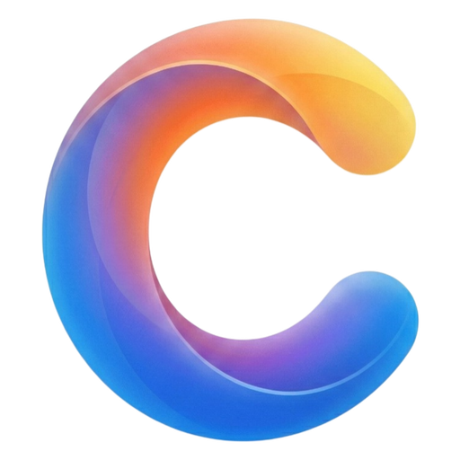

<div align="center">

#  AlgerClipboard

**A smart clipboard manager built with Tauri 2 + React 19**

Cloud Sync &bull; AI Summary &bull; Translation &bull; Spotlight &bull; Plugin System &bull; Rich Text Editing

[](https://github.com/algerkong/AlgerClipboard/releases)
[](LICENSE)
[]()
[]()

[中文](./README.zh-CN.md) | English

</div>

---

## Highlights

<table>
<tr>
<td width="50%">

### Clipboard History
Auto-capture text, images, rich text and file copies with instant search, type filtering, smart classification, and programming language detection.

</td>
<td width="50%">

### Cloud Sync
Sync across devices via WebDAV, Google Drive, or OneDrive with optional AES-256-GCM end-to-end encryption.

</td>
</tr>
<tr>
<td width="50%">

### AI Integration
Multi-provider AI support (OpenAI, Claude, Gemini, DeepSeek, Ollama). Auto-summarize long text, AI-powered translation, and Ask AI panel with built-in web access.

</td>
<td width="50%">

### Rich Text Editing
CodeMirror 6 code editor with 12+ language syntax highlighting, TipTap 2 WYSIWYG editor, Markdown preview with KaTeX math & Mermaid diagrams.

</td>
</tr>
<tr>
<td width="50%">

### Spotlight

Global search panel with unified search across all modes — clipboard, apps, bookmarks, calculator, and more in one place. Supports prefix routing, keyboard toggle, and 10+ plugin-powered modes.

</td>
<td width="50%">

### Plugin System

10+ built-in plugins: Calculator, Color Toolbox, Password Generator, Timestamp, URL Opener, Web Search, History, Browser Bookmarks, Network Info, GitHub Search. Extensible via JS frontend + optional Rust native backend.

</td>
</tr>
</table>

## Features

| Category | Details |
|----------|---------|
| **Clipboard** | Auto-capture text, images, rich text, files &bull; SHA-256 deduplication &bull; [FTS5 full-text search](./docs/en/search-guide.md) with pinyin, regex, time filter &bull; Smart content classification |
| **Editing** | CodeMirror 6 with toolbar (font size, line numbers, word wrap) &bull; TipTap 2 rich text WYSIWYG &bull; Split view (editor / split / preview) |
| **Rendering** | Markdown (GFM) &bull; KaTeX math formulas &bull; Shiki code highlighting &bull; Mermaid diagrams &bull; Rich text (clean/full mode) |
| **AI** | Multi-provider (OpenAI, Claude, Gemini, DeepSeek, Ollama, custom) &bull; Auto-summary &bull; AI translation &bull; Ask AI panel |
| **Cloud Sync** | WebDAV / Google Drive / OneDrive &bull; AES-256-GCM encryption &bull; Settings sync &bull; File size limits |
| **Translation** | Baidu / Youdao / Google engines &bull; AI translation mode &bull; Language auto-detect &bull; One-click copy |
| **Templates** | Reusable templates with variable substitution |
| **Organization** | Pin & favorites &bull; Tag system with CRUD &bull; Content categories &bull; Language detection (19 languages) |
| **Spotlight** | Unified global search &bull; Prefix routing &bull; Content-aware matching &bull; 10+ modes &bull; History (`!!`) &bull; Toggle shortcut &bull; Preserve query on reopen |
| **Plugins** | 10+ built-in plugins &bull; Calculator (`=`) &bull; Color Toolbox (`cc`) &bull; Password Generator (`pw`) &bull; Timestamp (`ts`) &bull; URL Opener &bull; Web Search (`??`) &bull; Browser Bookmarks (`bm`) &bull; Network Info (`ip`) &bull; GitHub Search (`gh`) |
| **UX** | Global hotkey (`Ctrl+Shift+V`) &bull; Arrow key navigation &bull; Smart window positioning &bull; Window size memory &bull; OCR |
| **Personalization** | Dark / Light / System theme &bull; Custom fonts &bull; UI scaling &bull; i18n (中文 / English) &bull; Auto-start |
| **Privacy** | All data stored locally &bull; Optional encrypted sync &bull; No telemetry |

## Spotlight

A unified global search panel — type anything to search across all enabled modes simultaneously. Use prefixes for targeted search.

| Mode | Prefix | Global | Description |
|------|--------|--------|-------------|
| Clipboard | `cc` | Yes | Search clipboard history, paste or copy |
| App Launcher | `aa` | Yes | Search installed apps, launch on Enter |
| Translate | `tt` | No | Multi-engine parallel translation with TTS |
| Calculator | `=` | Yes | Math expressions, unit/base conversion |
| Color Toolbox | `cc` | Yes | Parse HEX/RGB/HSL, Tailwind colors |
| Timestamp | `ts` | Yes | Convert timestamps, dates, time zones |
| URL Opener | — | Yes | Detect and open URLs in browser |
| Password Generator | `pw` | No | Generate secure passwords |
| Web Search | `??` | No | Search with Google, Bing, Baidu, etc. |
| History | `!!` | No | Revisit previously selected results |
| Browser Bookmarks | `bm` | Yes | Search Chrome/Edge/Brave bookmarks |
| Network Info | `ip` | Yes | IP lookup, DNS resolve, ping |
| GitHub Search | `gh` | No | Search repos, users, issues |
| IDE Projects | `\|` | Yes | Recent projects from VS Code, Cursor, etc. |
| Everything Search | `f` | Yes | File search via Everything (voidtools) |

Toggle with same shortcut, `Tab` to cycle modes, `Esc` to close. Query preserved on reopen.

## Plugin System

Extend AlgerClipboard with plugins loaded from `{app_data_dir}/plugins/`. Plugins can include:

- **Frontend JS bundle** — register Spotlight modes, context menus, settings sections, tray items, lifecycle hooks
- **Rust native backend** (.dll/.so/.dylib) — access filesystem, network, clipboard via host API with C ABI

### Plugin Structure

```
plugins/my-plugin/
├── manifest.json           # Metadata, permissions, mode declarations
├── frontend/
│   └── index.js            # JS bundle loaded at runtime
└── backend/
    └── my_plugin.dll       # Optional native library
```

### Developing Plugins

Plugins interact with the host through `window.AlgerPlugin.create("plugin-id")`:

```javascript
var api = window.AlgerPlugin.create("my-plugin");

api.registerMode({
  id: "my-mode",
  name: "My Mode",
  icon: "ph:star",
  placeholder: "Search...",
  onQuery: function(query) { return api.invokeBackend("search", { query }); },
  onSelect: function(result) { return api.invokeBackend("open", { id: result.id }); },
});
```

Manage plugins in **Settings > Plugins** (enable/disable/remove, permission grants).

## Installation

Download the latest release from [**GitHub Releases**](https://github.com/algerkong/AlgerClipboard/releases).

| Platform | Format | Architecture |
|----------|--------|--------------|
| Windows  | `.msi` / `.exe` | x64 |
| macOS    | `.dmg` | Universal |
| Linux    | `.deb` / `.AppImage` | x64 |

## Tech Stack

| Layer | Technology |
|-------|-----------|
| Framework | [Tauri 2](https://v2.tauri.app/) |
| Frontend | React 19 + TypeScript |
| Styling | Tailwind CSS 4 + shadcn/ui |
| State | Zustand |
| Code Editor | CodeMirror 6 |
| Rich Editor | TipTap 2 |
| Markdown | react-markdown + Shiki + KaTeX + Mermaid |
| Backend | Rust |
| Database | SQLite (WAL mode) |
| Encryption | AES-256-GCM + Argon2id |

## Development

### Prerequisites

- [Node.js](https://nodejs.org/) >= 20
- [pnpm](https://pnpm.io/) >= 9
- [Rust](https://www.rust-lang.org/tools/install) >= 1.77
- [Tauri CLI](https://v2.tauri.app/start/prerequisites/)

### Quick Start

```bash
# Install dependencies
pnpm install

# Run in development mode
pnpm tauri dev

# Build for production
pnpm tauri build
```

### Project Structure

```
src/                    # React frontend
├── components/         # UI components
│   ├── editor/         # CodeMirror, RichEditor, MarkdownPreview, SplitView
│   └── ui/             # shadcn/ui base components
├── pages/              # ClipboardPanel, DetailPage, Settings, AskAiPanel, SpotlightPanel
├── spotlight/          # Spotlight mode definitions (clipboard, app, translate)
├── plugin_system/      # Plugin loader, API, registry
├── stores/             # Zustand state management
├── services/           # Tauri IPC service layer
├── lib/                # Utilities (contentDetect, windowSize, richText)
├── i18n/               # Internationalization (zh-CN, en)
└── types/              # TypeScript type definitions

src-tauri/              # Rust backend
├── src/
│   ├── clipboard/      # Clipboard monitor and entry models
│   ├── commands/       # Tauri IPC command handlers
│   ├── storage/        # SQLite database and blob storage
│   ├── sync/           # Cloud sync engine, adapters, encryption
│   ├── translate/      # Translation engine integrations
│   ├── ocr/            # Windows OCR (Windows.Media.Ocr API)
│   ├── paste/          # System paste simulation
│   ├── plugin_system/  # Plugin manager, host API, FFI, permissions
│   └── app_launcher/   # Application scanner and launcher
└── icons/              # App icons

plugins/                # Plugin source code (buildable)
├── ide-projects/       # IDE Projects plugin (VS Code, Cursor, Windsurf, Trae, Zed)
```

## Search

Full-text search powered by SQLite FTS5 with multi-keyword, exact phrase, exclusion, regex, pinyin matching, time range filtering, and search history. See the [Search Guide](./docs/en/search-guide.md) for details.

## Cloud Sync Setup

See the [Cloud Sync Guide](./docs/en/cloud-sync-guide.md) for detailed configuration instructions.

## OCR Development

See the [RapidOCR Development Guide](./docs/en/rapidocr-development.md) for runtime packaging, installer flow, and release automation details.

## Donate

If you find AlgerClipboard useful, consider supporting the project:

<div align="center">

**[Donate](https://donate.alger.fun/donate)**

</div>

## License

[GPL-3.0](LICENSE)
